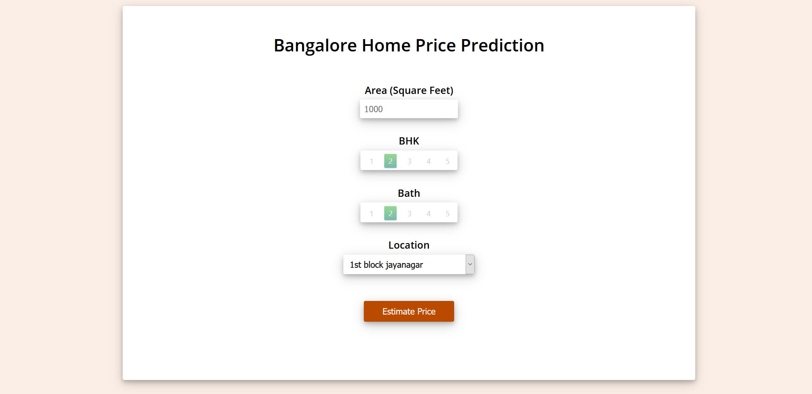

# Home-Prices-Prediction

### description
A Webpage built using Python Flask server, Nginx and a Machine Learning Regression model that predicts home prices. The website is built in html, css and javascript that allows user to enter home square ft area, bedrooms etc and it will call python flask server to retrieve the predicted price. 

### Screenshot

### Demo 

### Dataset 
The dataset used to train and test the model is downloaded from kaggle : https://www.kaggle.com/amitabhajoy/bengaluru-house-price-data

### Architecture
- client : html,css,javascript 
- Model : python - sklearn, matplotlib, pandas, numpy 
- server : python flask server, nginx web server

### Developement Environment 

Jupyter notebook, visual studio code and pycharm as IDE

### Run Locally

- To install nginx/Windows, download the latest mainline version distribution (1.21.5). Then unpack the distribution, go to the nginx-1.21.5 directory, and run nginx.
- configure nginx conf file in nginx/conf/ directory using conf file in nginx_files folder in the repository
- download the Anaconda installer and install it to get all the required python modules
- run **python server.py** in the terminal to start the python flask server and browse to localhost in a webbrowser to run the website
